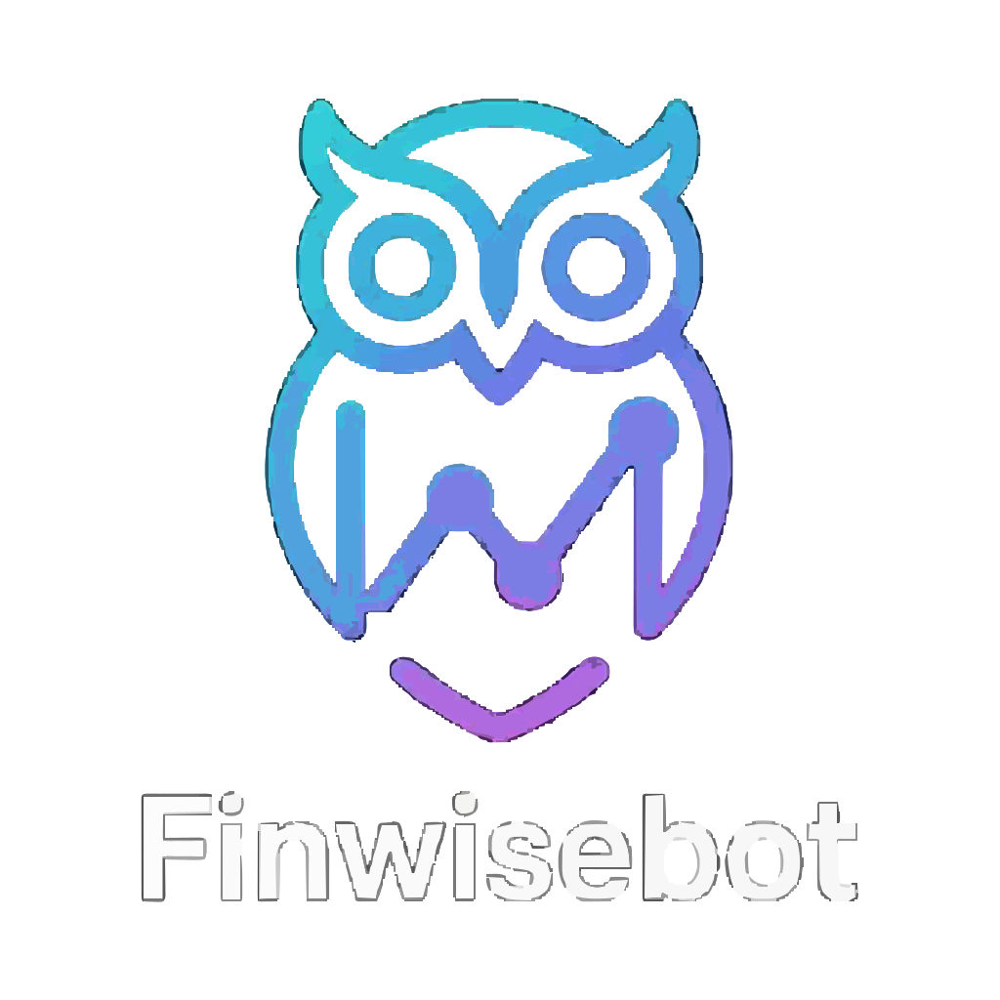

# 🚀 FinWisebot - AI-Powered Financial Analysis Platform



**FinWisebot** is a cutting-edge, modern financial analysis platform that combines artificial intelligence with real-time market data visualization. Built with Next.js 14 and featuring a stunning glassmorphism UI, it provides comprehensive financial insights, AI-powered chat interactions, predictive analytics, and interactive market visualizations.

## ✨ Key Features

### 🎯 Core Functionality
- **AI-Powered Financial Chat**: Interactive conversations with Peeko, the AI financial assistant
- **Real-Time Market Data**: Live market snapshots with interactive charts and indicators
- **Predictive Analytics**: AI-driven market predictions and trading signals
- **Backtesting Engine**: Historical strategy testing and performance analysis
- **Document Analysis**: AI-powered summarization of financial documents and reports
- **News Aggregation**: Real-time financial news feed with sentiment analysis

### 🎨 Modern UI/UX
- **Glassmorphism Design**: Sleek, translucent cards with backdrop blur effects
- **Responsive Design**: Fully responsive across desktop, tablet, and mobile devices
- **Dark/Light Theme**: Automatic theme switching with localStorage persistence
- **Animated Elements**: Smooth animations, floating particles, and gradient effects
- **Interactive Charts**: SVG-based charts with real-time data simulation

### 🔧 Technical Features
- **Client-Side Demo Mode**: Full functionality without backend requirements
- **localStorage Persistence**: Data persistence across browser sessions
- **Dynamic Imports**: Optimized loading with Next.js dynamic imports
- **Mock API System**: Complete API simulation for development and demo purposes

## 🛠️ Technology Stack

### Frontend Framework
- **Next.js 14** - React framework with App Router
- **React 18** - UI library with concurrent features
- **Pages Router** - File-based routing system

### Styling & UI
- **Tailwind CSS 3.3.2** - Utility-first CSS framework
- **Custom CSS** - Advanced animations and glassmorphism effects
- **PostCSS** - CSS processing and optimization
- **Autoprefixer** - Automatic CSS vendor prefixing

### Backend & APIs
- **Next.js API Routes** - Serverless API endpoints
- **MongoDB** - Database for production deployment
- **Mongoose** - MongoDB object modeling
- **Google Gemini AI** - AI chat and analysis capabilities
- **NextAuth.js** - Authentication framework

### Development Tools
- **ESLint** - Code linting and quality
- **Prettier** - Code formatting
- **VS Code** - Recommended IDE with extensions

## 📁 Project Structure

```
finwisebot_website/
├── src/
│   ├── components/           # Reusable UI components
│   │   ├── AmbientOrbs.jsx      # Animated background orbs
│   │   ├── ChatWidget.jsx       # AI chat interface
│   │   ├── DemoVisualizer.jsx   # Market data visualization
│   │   ├── FeatureCard.jsx      # Feature showcase cards
│   │   ├── Footer.jsx          # Site footer
│   │   ├── GlobalBackground.jsx # Global background effects
│   │   ├── Hero.jsx            # Hero section components
│   │   ├── Navbar.jsx          # Navigation bar
│   │   ├── PredictionWidget.jsx # AI prediction interface
│   │   └── ...
│   ├── data/                 # Static data files
│   │   └── users.json         # User data template
│   ├── lib/                  # Utility libraries
│   │   ├── mockApi.js         # Client-side API simulation
│   │   ├── mongoose.js        # Database connection
│   │   └── secure.js          # Encryption utilities
│   ├── models/               # Database models
│   │   ├── Chat.js           # Chat message model
│   │   ├── Setting.js        # User settings model
│   │   └── User.js           # User authentication model
│   ├── pages/                # Next.js pages (Pages Router)
│   │   ├── _app.jsx          # App wrapper
│   │   ├── _document.jsx     # Document template
│   │   ├── index.jsx         # Homepage
│   │   ├── PeekoChat.jsx     # AI chat page
│   │   ├── billing-maintenance.jsx # Maintenance page
│   │   ├── features.jsx      # Features showcase
│   │   ├── contact.jsx       # Contact page
│   │   ├── news.jsx          # News feed
│   │   ├── demo.jsx          # Demo page
│   │   ├── login.jsx         # Authentication
│   │   ├── signup.jsx        # User registration
│   │   ├── dashboard.jsx     # User dashboard
│   │   ├── reports.jsx       # Financial reports
│   │   ├── backtest.jsx      # Strategy backtesting
│   │   └── api/              # API endpoints
│   │       ├── auth.js       # Authentication API
│   │       ├── chat.js       # Chat API
│   │       ├── backtest.js   # Backtesting API
│   │       ├── user.js       # User management API
│   │       └── ...
│   ├── styles/               # CSS stylesheets
│   │   ├── globals.css       # Global styles and utilities
│   │   └── components.css    # Component-specific styles
│   └── utils/                # Utility functions
│       ├── helpers.js        # Helper functions
│       └── storage.js        # localStorage utilities
├── public/                   # Static assets
│   ├── favicon.svg          # Site favicon
│   ├── finewisbot.svg       # Main FinWiseBot logo
│   └── peekochat.svg        # PeekoChat logo
├── scripts/                 # Build and deployment scripts
├── docs/                    # Documentation
├── langui/                  # Component preview system
├── ml_service/              # Machine learning services
├── docker-compose.yml       # Docker configuration
├── netlify.toml            # Netlify deployment config
├── tailwind.config.js      # Tailwind CSS configuration
├── postcss.config.js       # PostCSS configuration
├── package.json            # Dependencies and scripts
└── README.md               # This file
```

## 🚀 Quick Start

### Prerequisites
- **Node.js** 18.x or higher
- **npm** or **yarn** package manager
- **Git** for version control

### Installation

1. **Clone the repository**
   ```bash
   git clone https://github.com/assassinyousuf/finwisebot_website.git
   cd finwisebot_website
   ```

2. **Install dependencies**
   ```bash
   npm install
   # or
   yarn install
   ```

3. **Environment Setup** (Optional - for full backend features)
   ```bash
   cp .env.example .env.local
   # Edit .env.local with your API keys and database credentials
   ```

4. **Start development server**
   ```bash
   npm run dev
   # or
   yarn dev
   ```

5. **Open your browser**
   Navigate to `http://localhost:3000`

### Build for Production

```bash
npm run build
npm run start
```

## 📖 Usage Guide

### 🏠 Homepage (`/`)
- **Market Overview**: Interactive cards showing key market metrics
- **Live Charts**: Real-time price charts with trend indicators
- **AI Predictions**: Predictive analytics widgets
- **News Feed**: Latest financial news with sentiment analysis
- **Feature Showcase**: Highlighted platform capabilities

### 💬 PeekoChat (`/PeekoChat`)
- **AI Assistant**: Chat with Peeko for financial analysis
- **Market Snapshot**: Comprehensive market data visualization
- **Interactive Charts**: Expandable charts with detailed metrics
- **Real-time Data**: Live market indicators and signals

### ⚙️ Features (`/features`)
- **Platform Capabilities**: Detailed feature descriptions
- **Statistics**: User counts, strategies, and signals
- **Interactive Demos**: Live feature demonstrations

### 📰 News (`/news`)
- **Financial News Feed**: Real-time market news
- **Sentiment Analysis**: AI-powered news sentiment scoring
- **Categorized Content**: Organized by market sectors

### 📊 Dashboard (`/dashboard`)
- **Portfolio Overview**: Personal investment tracking
- **Performance Metrics**: Returns and risk analysis
- **Custom Alerts**: Personalized notification system

### 🔄 Backtesting (`/backtest`)
- **Strategy Testing**: Historical performance analysis
- **Multiple Assets**: Support for various financial instruments
- **Risk Metrics**: Sharpe ratio, drawdown analysis

## 🔌 API Endpoints

### Authentication
- `POST /api/auth` - User authentication
- `GET /api/me` - Current user information
- `POST /api/auth/logout` - User logout

### Chat & AI
- `POST /api/chat` - Send message to AI assistant
- `GET /api/chat/history` - Chat message history

### Financial Data
- `GET /api/backtest` - Backtesting results
- `POST /api/predictions` - Generate market predictions
- `GET /api/news` - Financial news feed

### User Management
- `GET /api/user` - User profile data
- `PUT /api/user` - Update user settings
- `POST /api/user/signup` - User registration

## 🎨 Design System

### Color Palette
- **Primary**: Slate-900 with purple-900/20 gradients
- **Accent**: Cyan (#06b6d4) to blue (#58b7ff) gradients
- **Secondary**: Pink (#d88bff) accents
- **Background**: Dynamic animated gradients

### Typography
- **Headings**: Poppins font family
- **Body**: Inter font family
- **Code**: Roboto Mono monospace

### Components
- **Glass Cards**: Backdrop blur with subtle borders
- **Animated Orbs**: Floating gradient spheres
- **Particle Effects**: Subtle animated particles
- **Interactive Charts**: SVG-based with glow effects

### Animations
- **Entrance Animations**: Smooth fade-in effects
- **Hover States**: Scale and shadow transitions
- **Loading States**: Skeleton screens and spinners
- **Chart Animations**: Progressive line drawing

## 🔧 Development

### Available Scripts

```json
{
  "dev": "next dev",              // Start development server
  "build": "next build",          // Build for production
  "start": "next start",          // Start production server
  "test-mongo": "node scripts/test-mongo-conn-verbose.js",
  "save-api-key": "node scripts/save-api-key.js",
  "seed-admin": "node scripts/seed-admin.js"
}
```

### Environment Variables

Create a `.env.local` file with:

```env
# Database
MONGODB_URI=mongodb://localhost:27017/finwisebot

# Authentication
NEXTAUTH_SECRET=your-secret-key
NEXTAUTH_URL=http://localhost:3000

# AI Services
GOOGLE_GEMINI_API_KEY=your-gemini-api-key
GEMINI_MODEL=models/text-bison-001

# Google OAuth (optional)
GOOGLE_CLIENT_ID=your-google-client-id
GOOGLE_CLIENT_SECRET=your-google-client-secret

# Service Account (optional)
GOOGLE_SERVICE_ACCOUNT_JSON=path-to-service-account.json
```

### Mock API System

The application includes a comprehensive mock API system (`src/lib/mockApi.js`) that:

- **Persists data** in localStorage for demo purposes
- **Simulates all API endpoints** without backend requirements
- **Provides realistic data** for development and testing
- **Supports authentication** and user sessions

### Component Architecture

#### Key Components

- **Navbar**: Responsive navigation with theme toggle
- **Footer**: Site footer with links and branding
- **ChatWidget**: AI chat interface with typing indicators
- **DemoVisualizer**: Advanced market data visualization
- **PredictionWidget**: AI prediction display
- **FeatureCard**: Reusable feature showcase cards

#### Dynamic Imports

Performance is optimized using Next.js dynamic imports:

```javascript
const DemoVisualizer = dynamic(() => import('../components/DemoVisualizer'), {
  ssr: false
});
```

## 🚀 Deployment

### Netlify Deployment

1. **Connect Repository**: Link GitHub repository to Netlify
2. **Build Settings**:
   - Build Command: `npm run build`
   - Publish Directory: `.next`
3. **Environment Variables**: Configure in Netlify dashboard
4. **Deploy**: Automatic deployments on push to main branch

### Docker Deployment

```bash
# Build Docker image
docker build -t finwisebot .

# Run with Docker Compose
docker-compose up -d
```

### Manual Deployment

```bash
# Build the application
npm run build

# Start production server
npm run start
```

## 🤝 Contributing

### Development Workflow

1. **Fork** the repository
2. **Create** a feature branch: `git checkout -b feature/your-feature`
3. **Make** your changes and test thoroughly
4. **Commit** with descriptive messages: `git commit -m "Add: feature description"`
5. **Push** to your fork: `git push origin feature/your-feature`
6. **Create** a Pull Request

### Code Standards

- **ESLint**: Follow linting rules
- **Prettier**: Use consistent formatting
- **TypeScript**: Use JSDoc comments for complex functions
- **Accessibility**: Ensure WCAG 2.1 AA compliance

### Testing

```bash
# Run tests (when implemented)
npm test

# Run linting
npm run lint

# Type checking (if TypeScript added)
npm run type-check
```

## 📊 Performance

### Optimization Features

- **Dynamic Imports**: Lazy loading of heavy components
- **Image Optimization**: Next.js automatic image optimization
- **Code Splitting**: Automatic route-based code splitting
- **Caching**: Aggressive caching strategies
- **Compression**: Gzip compression for assets

### Bundle Analysis

```bash
# Analyze bundle size
npm install -g @next/bundle-analyzer
ANALYZE=true npm run build
```

## 🔒 Security

### Authentication
- **NextAuth.js**: Secure authentication framework
- **JWT Tokens**: Stateless authentication
- **Password Hashing**: bcryptjs for secure password storage
- **Session Management**: Secure session handling

### API Security
- **Input Validation**: Comprehensive input sanitization
- **Rate Limiting**: API rate limiting (when backend deployed)
- **CORS**: Proper CORS configuration
- **HTTPS**: SSL/TLS encryption in production

## 📈 Analytics & Monitoring

### Built-in Features
- **Error Boundaries**: React error boundary components
- **Performance Monitoring**: Web Vitals tracking
- **User Analytics**: Basic usage tracking
- **Error Logging**: Client-side error reporting

## 🐛 Troubleshooting

### Common Issues

1. **Build Errors**
   ```bash
   rm -rf .next node_modules
   npm install
   npm run build
   ```

2. **API Connection Issues**
   - Check environment variables
   - Verify MongoDB connection
   - Check API key validity

3. **Styling Issues**
   - Clear browser cache
   - Check Tailwind configuration
   - Verify CSS imports

### Debug Mode

Enable debug logging:

```javascript
// In browser console
localStorage.setItem('debug', 'true');
```

## 📚 Resources

### Documentation
- [Next.js Documentation](https://nextjs.org/docs)
- [Tailwind CSS Guide](https://tailwindcss.com/docs)
- [React Documentation](https://react.dev)
- [MongoDB Documentation](https://docs.mongodb.com)

### Related Projects
- [NextAuth.js](https://next-auth.js.org)
- [Mongoose ODM](https://mongoosejs.com)
- [Google Gemini AI](https://ai.google.dev)

## 📄 License

This project is proprietary software. All rights reserved.

## 📞 Contact & Support

- **Email**: support@finwisebot.com
- **Website**: https://finwisebot.com
- **GitHub**: https://github.com/assassinyousuf/finwisebot_website
- **Documentation**: [Internal Docs](./docs/)

## 🎯 Roadmap

### Upcoming Features
- [ ] Mobile App (React Native)
- [ ] Advanced Backtesting Engine
- [ ] Real-time WebSocket Connections
- [ ] Multi-language Support
- [ ] Advanced AI Models Integration
- [ ] Portfolio Optimization Tools
- [ ] Social Trading Features

### Technical Improvements
- [ ] TypeScript Migration
- [ ] Comprehensive Test Suite
- [ ] CI/CD Pipeline
- [ ] Performance Monitoring
- [ ] Advanced Caching Strategies

---

**Built with ❤️ using Next.js, React, and Tailwind CSS**

*Last updated: November 7, 2025*
